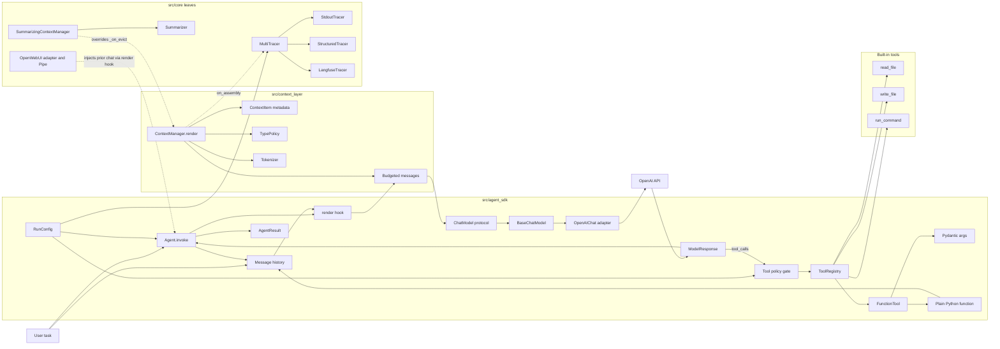
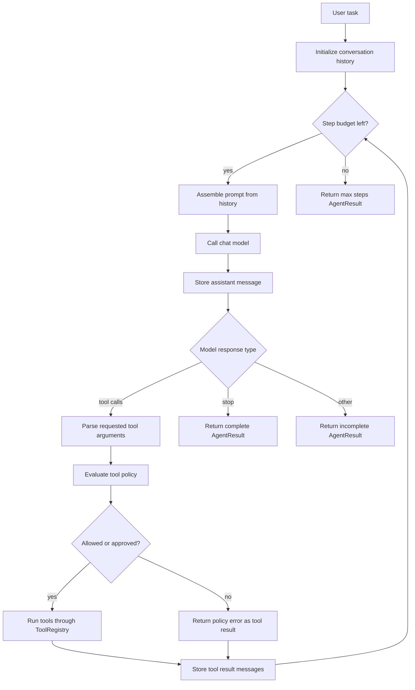
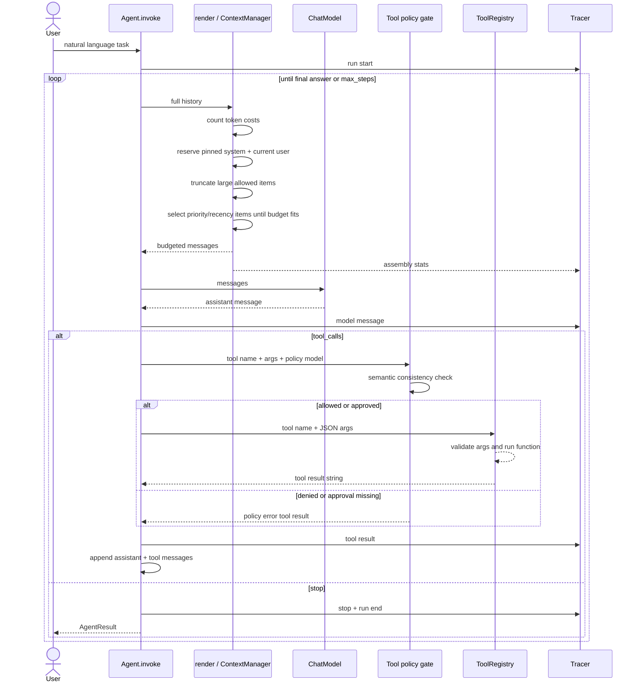
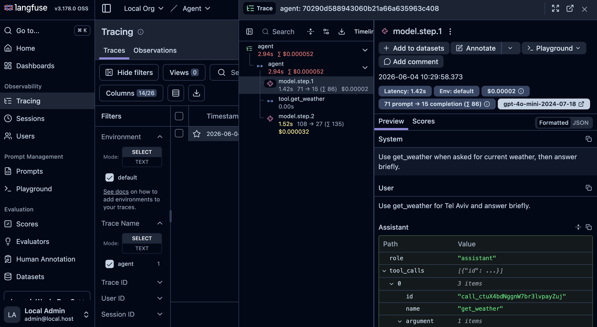

# AI Simple Harness Agentic Framework

## What This Is

Minimal Python harness agent SDK with context budgeting and core observability, summarization, and tool policy gating.

Show a real tool-use loop, a lean context management layer, and production-minded core features without turning the project into a framework.


## Solution Structure

- `src/agent_sdk/` is the base SDK. `agent.py` owns the model-driven loop:
  assemble messages, call the model, execute requested tools, append tool
  results, and stop on final answer or max steps. `tools.py` wraps plain Python
  functions with Pydantic validation and OpenAI-compatible schemas. `policy.py`
  adds a small tool-call gate before execution.
- `src/context_layer/` is the prompt-budgeting layer.  `manager.py` takes full
  history plus registered context and returns the message list sent to the
  model. It protects system/current-user messages, ranks context by metadata,
  truncates allowed items, and evicts lower-value context when budget is tight.
- `src/core/` contains optional production-minded extensions that do not change
  the base SDK: summary memory, structured JSONL telemetry, Langfuse tracing,
  the local Langfuse stack under `src/core/observability/`, and an OpenWebUI
  integration under `src/core/integrations/` + `src/core/openwebui/`. Everything
  under `src/core/` is a leaf — the base SDK never imports it, so the agent loop,
  tests, and demos run identically whether or not these extras are set up.
- `src/demos/` contains runnable entry points and sample files. `demo.py` shows the
  file/tool loop, `demo_context.py` shows context budgeting, `demo_run_command.py`
  shows an OpenAI-backed command loop, `demo_policy_gate.py` shows HITL tool approval,
  and `demo_core.py`/`demo_langfuse.py` show core tracing.
- `src/tests/` verifies SDK, context, and core behavior with fake models, so the test suite does not need an API key.
- `pyproject.toml`, `uv.lock`, and `Makefile` define the project environment and the commands a reviewer should run.

## Components Diagram



## Agentic Loop Diagram

The SDK is a small loop around an LLM.  
It sends the current task and history to the model, lets the model decide whether it needs a tool, runs only the requested tools, adds tool results back into history, then asks the model again.  
The loop stops when the model returns a final answer or when `RunConfig.max_steps` is reached.  

The agent loop owns control flow: message history, tool validation, tool execution, tracing, and stop conditions.
The model owns decisions.  

The context layer owns prompt assembly and budgeting before each model call; it does not own loop control.

Every agent-managed tool call passes through the policy gate before execution. The gate validates the policy model, runs a semantic consistency evaluator, and requires approval for destructive, network, or low-confidence dangerous actions.



## Runtime Sequence Diagram

One run with one model-requested tool call. Before each model call, the context
layer enforces the token budget, then the same loop repeats only when the model
returns `tool_calls`; there is no hard-coded tool sequence.



## Core

The base solution is the agent loop plus context layer. Core work adds valuable extensions:

### Context Summarizer

`SummarizingContextManager` keeps useful memory by summarizing evicted conversation/context instead of only dropping it.

Run it with `make demo-core`, or directly with `uv run python src/demos/demo_core.py`.

### Observability

**Langfuse** support: Run structured telemetry with `make demo-core`. 
Run local Langfuse with `make langfuse-demo`; stop it with `make langfuse-down`.  
Local Langfuse files live in `src/core/observability/`.

> Email: admin@local.host

> Password: password123

`StructuredTracer` emits JSONL telemetry for model, tool, stop, and context assembly events. 

`LangfuseTracer` publishes live traces with model steps, tool spans, token usage, cost, and latency. 
The SDK still defaults to `NoopTracer`; tracing is opt-in
through `RunConfig.tracer`.




### Policy Gate

The tool policy gate **evaluates** every requested tool call before execution.  
It is enabled by default, validates the policy model, runs a lightweight **semantic consistency** evaluator, and requires human approval for destructive, network, or low-confidence dangerous actions.  
The code lives in `src/agent_sdk/` because the gate must sit on the SDK execution path.

Run it with `make demo-policy-gate`, or directly with `uv run python src/demos/demo_policy_gate.py`.

### OpenWebUI Integration

The optional OpenWebUI bridge lives outside the base SDK.  
`src/core/integrations/openwebui_adapter.py` maps OpenWebUI chat history into the existing `Agent(render=...)` seam, and `src/core/openwebui/openwebui_pipe.py` is the
thin Pipe Function wrapper.  
The base SDK imports nothing from this integration.

Run it with `make openwebui-up`; stop it with `make openwebui-down`. Run details live
in `src/core/openwebui/README.md`.  
The compose file is `src/core/openwebui/docker-compose.openwebui.yml`.

Security: when tools are enabled, file and command tools run inside the OpenWebUI container.  
The policy gate is a guardrail, not a sandbox. Use `ENABLE_TOOLS=false` for shared or public deployments.

## Run

From repo root:

```bash
# init - creates `.env` files from `.env.exapmle` when missing, replace the OPENAI_API_KEY placeholder in the `.env` file
make init

# run langfuse include docker compose 
make langfuse-up
make langfuse-demo
make langfuse-down

# run openwebui
make openwebui-up

# tests - simulate llm calls
make test # runs `uv sync`, then the full test suite.

# demo scenarios with real llm calls
make demo-all

# individual demo run
make demo-file
make demo-context
make demo-core
make demo-run-command
make demo-policy-gate
```

Direct demo run:

```bash
uv run python src/demos/demo_run_command.py
uv run python src/demos/demo_policy_gate.py
uv run python src/demos/demo.py
uv run python src/demos/demo_context.py
uv run python src/demos/demo_core.py
uv run python src/demos/demo_langfuse.py
```


## Design Decisions

- The agent SDK depends on protocols, not OpenAI.
- Messages are plain dicts with an OpenAI-like chat shape. This keeps the SDK small
  and makes tool-call round trips explicit.
- `RunConfig.max_steps` has a hard ceiling, so a bad model cannot loop forever.
- `RunConfig.tool_policy_model`, `semantic_policy_evaluator`, and `approver`
  form one default-on policy gate for all agent-managed tool calls. The LLM can
  propose policy labels, but the SDK validates structure, checks semantic
  consistency, and can escalate beyond `action="allow"` based on risk, scope,
  or low confidence.
- Context budgeting plugs into `Agent(render=...)`; `render` means "assemble final
  model messages" (not UI rendering). The SDK stays unchanged.
- Context selection is metadata-driven: each item has type, priority, token cost, and
  flags such as `pinned` or `truncatable`.
- System messages and the current user task are protected. Large docs/tool outputs may
  be truncated. Lower-priority or older turns are evicted when the budget is tight.
- Selection is greedy by priority and recency. It fills useful budget, but it is not a
  strict priority-prefix algorithm or global knapsack optimizer.
- Pinned overflow raises `ContextOverflow` instead of silently truncating system
  instructions or the current user task.
- Budgeting uses `tiktoken` estimates. The counter includes message content, tool-call function
  names/arguments, and simple framing overhead, not provider-perfect accounting.
- Assistant tool calls and their tool results are treated as one turn, so selected
  prompts stay valid for OpenAI-style tool sequencing.
- Core features compose through existing seams: `_on_evict` for summaries,
  `on_assembly` for context telemetry, and `RunConfig.tracer`/`MultiTracer` for
  stdout, JSONL, and Langfuse tracing. No base-SDK rewrite.
- The policy gate is intentionally in the SDK, not under `src/core/`, because safety
  must happen at the tool execution choke point. This protects calls made through
  `Agent._run_tool`; direct `tool.invoke(...)` calls are still raw tool calls and
  are not self-guarded.
- Tools use Pydantic schemas and execute through one registry.

## Deliberate Non-Goals

- No planner, memory database, async runtime, transient retries, or streaming. They would add
  weight for a simple harness.
- No dedicated SDK `State` object or memory database. Within one `Agent.invoke(...)` call, conversation history is the state: assistant and
  tool messages accumulate in memory. Across calls, the base SDK starts fresh
  unless the caller injects prior history; OpenWebUI does this by design through
  the adapter/render seam.
- No full sandbox/container isolation. The policy gate is a lightweight
  human-in-the-loop control with best-effort heuristics, not an OS security
  boundary or a complete command sandbox.
- No provider-specific logic in the agent loop. Provider details live in adapters.
- No complex context-type inheritance. New behavior should come from item metadata and
  policy, not from rewriting selection logic.
